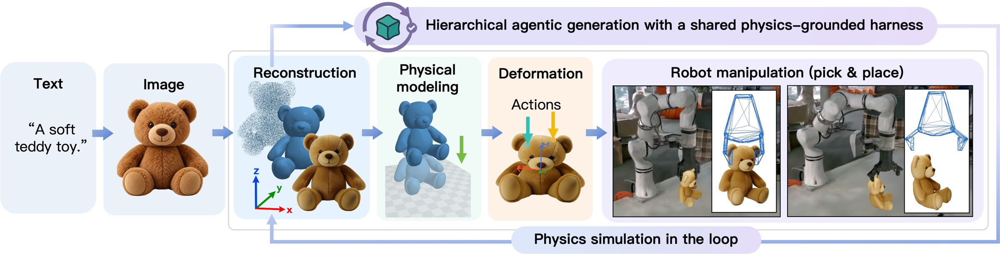
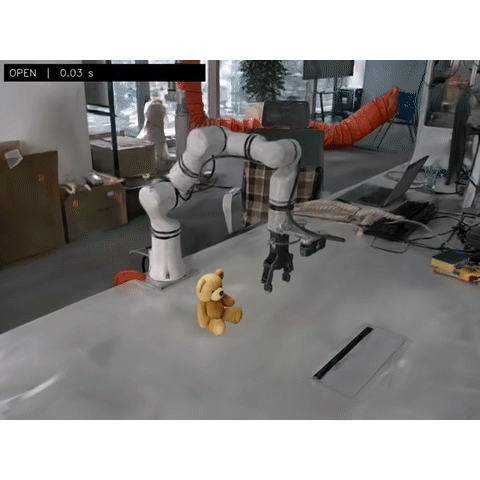
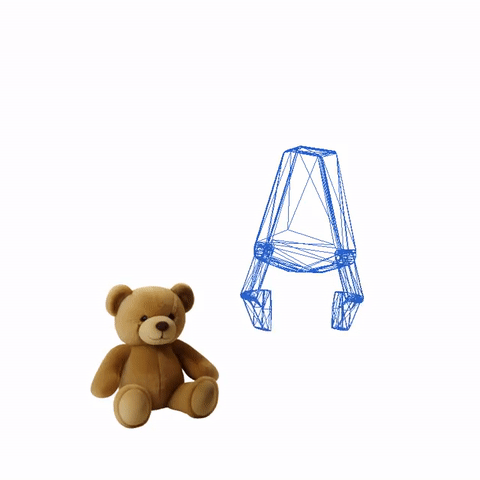

# DeformSmith: Physics Harness-Guided Hierarchical Generation of Deformable Assets for Robot Manipulation

DeformSmith generates deformable assets from text or a single image, connecting geometry, physical modeling, material behavior, and robot interaction through a shared physics harness.

## Robot Manipulation Demos

| Scene view | Close-up view |
| :---: | :---: |
|  |  |

## Code Release

Code and reproducibility instructions will be released here. Stay tuned for updates.
